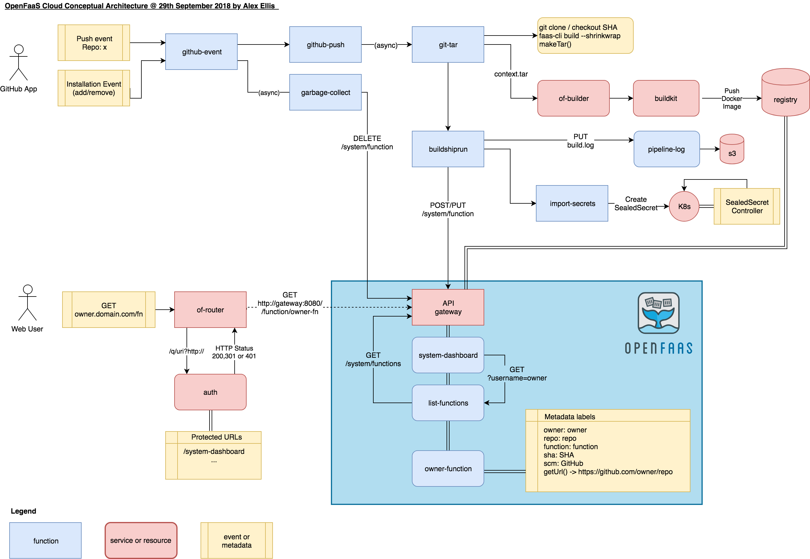

OpenFaaS Cloud
==============

OpenFaaS Cloud: multi-user serverless functions managed with git

*Announcement from Cisco's DevNet Create in Mountain View*

## Description

OpenFaaS Cloud introduces an automated build and management system for your Serverless functions with native integrations into your source-control management system whether that is GitHub or GitLab.

With OpenFaaS Cloud functions are managed through typing `git push` which reduces the tooling and learning curve required to operate functions for your team. As soon as OpenFaaS Cloud receives a `push event` from `git` it will run through a build-workflow which clones your repo, builds a Docker image, pushes it to a registry and then deploys your functions to your cluster. Each user can access and monitor their functions through their personal dashboard.

Features:

* Portable - self-host or use the hosted Community Cluster (SaaS)
* Multi-user - use your GitHub/GitLab identity to log into your personal dashboard
* Automates CI/CD triggered by `git push` (also known as GitOps)
* Onboard new git repos with a single click by adding the *GitHub App* or a repository tag in *GitLab*
* Immediate feedback on your personal dashboard and through GitHub Checks or GitLab Statuses
* Sub-domain per user or organization with HTTPS
* Fast, non-root image builds using Docker's buildkit

The dashboard page for a user:

The details page for a function:

### Requirements

* OpenFaaS (0.9.10 or greater is recommended)
* Docker Swarm or Kubernetes (other OpenFaaS providers may work in the future)

## Blog post

Read my [introducing OpenFaaS Cloud](https://blog.alexellis.io/introducing-openfaas-cloud/) blog post for an overview of the idea with examples, screenshots and background on the project.

## Conceptual architecture diagram

This conceptual diagram shows how OpenFaaS Cloud integrates with GitHub/GitLab through the use of an event-driven architecture.

Main flows:

1. User pushes code - GitHub/GitLab push event is sent to github-event/gitlab-event function triggering a CI/CD workflow
2. User removes GitHub/GitLab app from one or more repos - garbage collection is invoked removing 1-many functions
3. User accesses function via router using "pretty URL" format and request is routed to function via API Gateway

See also: [COMPONENTS.md](docs/COMPONENTS.md) for detailed information on each component.

## Roadmap & Features

See the [Roadmap & Features](docs/ROADMAP.md)

## Try it out

You can set up and host your own *OpenFaaS Cloud* or contact alex@openfaas.com for instructions on how to participate in a public trial of a fully-hosted service (a.k.a. Community Cluster). Read the privacy statement and terms and conditions for the hosted version of [OpenFaaS Cloud](./PRIVACY.md).

Read the [development guide](docs/README.md) to find out more about the functions and to start hacking on OpenFaaS Cloud.

## Getting help

For help join #openfaas-cloud on the [OpenFaaS Slack workspace](https://docs.openfaas.com/community).
