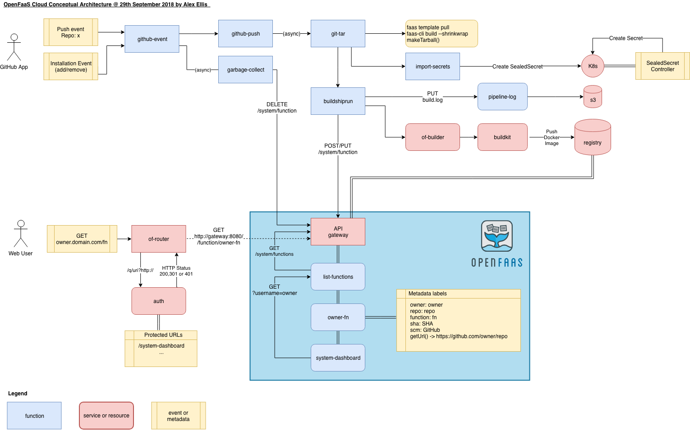

OpenFaaS Cloud
==============

OpenFaaS Cloud - portable, multi-user Serverless Functions powered by GitOps

*Announcement from Cisco's DevNet Create in Mountain View*

## Description

OpenFaaS Cloud is a portable, multi-user Serverless Functions platform powered by GitOps. OpenFaaS Cloud introduces a build-system for your functions and native integrations into GitHub meaning that you just run `git push` to deploy your code. As soon as OpenFaaS Cloud receives the `push event` it will clone your Git repo, build, push and then deploy your function with a rolling update to your own sub-domain with HTTPS.

Features:

* Portable - run anywhere or use the hosted Community Cluster
* Multi-user - use your GitHub identity to log into your personal dashboard
* Applies GitOps principles - your `git` repo is the source of truth
* Integrate repos with a single click  through the *GitHub App*
* Immediate feedback - live build notifications for your commits
* HTTPS endpoints per user
* Secured through HMAC - the public facing function "github-event" uses HMAC to verify the origin of events

> OpenFaaS Cloud packages, builds and deploys functions using OpenFaaS. Moby's BuildKit is used to build images and push to a local Docker registry instance.

The dashboard page for a user:

The details page for a function:

## Blog post

Read my [introducing OpenFaaS Cloud](https://blog.alexellis.io/introducing-openfaas-cloud/) blog post for an overview of the idea with examples, screenshots and background on the project.

## Roadmap & Features

* Core experience

- [x] Self-hosted deployment on Kuberneters or Docker Swarm
- [x] GitHub Status API integration for commits
- [x] Automatic HTTPS for endpoints (yes via CertManager/Traefik)
- [x] Authorization with a CUSTOMER list
- [x] Trust with GitHub via HMAC and GitHub App
- [x] CI/CD for functions
- [x] Container builder using BuildKit
- [x] Free to use SaaS edition for community members and contributors
- [x] Log storage on Minio (S3-compatible)
- [x] Log storage on AWS S3
- [ ] Kubernetes helm chart (plain YAML supported already)
- [ ] Automation for the day-0 installation via Ansible or similar

* Developer story

- [x] Multi-user
- [x] UI: [Dashboard for users](./dashboard)
- [x] Support secrets in public repos through Bitnami SealedSecrets
- [x] Make detailed logs available to show build or unit test failures (dashboard)
- [x] Make build logs available publicly (dashboard finished, Checks API in progress)
- [x] Mixed-case user-names
- [ ] Use a git "tag" or "GitHub release" to promote a function to live
- [ ] UI: Dashboard - detailed metrics of success/failure per function in

* Operationalize

- [x] Support for shared Docker Hub accounts instead of private registry
- [x] Support for private GitHub repos
- [x] Dashboard: OAuth 2 login via GitHub
- [x] Isolation between functions (through the provided NetworkPolicy on Kubernetes)

* Stretch goals

- [x] Move Dashboard UI to React.js
- [ ] Re-write React.js Dashboard to use native Bootstrap library
- [ ] CI/CD integration with on-prem GitLab (in-progress)
- [ ] UI: OAuth 2 login via GitLab (planned, help wanted)
- [ ] Unprivileged builds with BuildKit or similar (under investigation)
- [ ] Log into OpenFaaS Cloud via CLI (faas-cli cloud login)
- [ ] Enable untrusted container builds via docker-machine?
- [ ] Integration with on-prem BitBucket (help wanted)

## Functions

OpenFaaS Cloud is built using OpenFaaS Golang functions to interact with GitHub and build your functions from source and deploy them - live within seconds of typing: `git push`.

* Function: github-event

Receives events from the GitHub app and checks the origin via HMAC

* Function: github-push

Handles push events from the "github-event" function

* Function: git-tar

Clones the git repo and checks out the SHA then uses the OpenFaaS CLI to shrinkwrap a tarball to be build with Docker

* Function: buildshiprun

Submits the tar to the of-builder then configures an OpenFaaS deployment based upon stack.yml found in the Git repo. Finally starts a rolling deployment of the function.

Calls garbage-collect

* Function: garbage-collect

Function cleans up functions which were removed or renamed within the repo for the given user.

* Service: of-builder

A builder daemon which exposes the GRPC of-buildkit service via HTTP.

* Service: of-buildkit

The buildkit GRPC daemon which builds the image and pushes it to the internal registry. The image is tagged with the SHA of the Git commit event.

* Service: Docker open-source registry

A private, local registry is deployed inside the cluster.

## Conceptual architecture diagram

This conceptual diagram shows how OpenFaaS Cloud integrates with GitHub through the use of an event-driven architecture.

Main flows:

1. User pushes code - GitHub push event is sent to github-event function triggering a CI/CD workflow
2. User removes GitHub app from one or more repos - garbage collection is invoked removing 1-many functions
3. User accesses function via router using "pretty URL" format and request is routed to function via API Gateway

## Try it out

You can set up and host your own *OpenFaaS Cloud* or contact alex@openfaas.com for instructions on how to participate in a public trial of a fully-hosted service. Read the privacy statement and terms and conditions for the hosted version of [OpenFaaS Cloud](./PRIVACY.md).

Read the [development guide](docs/README.md) to find out more about the functions and to start hacking on OpenFaaS Cloud.
