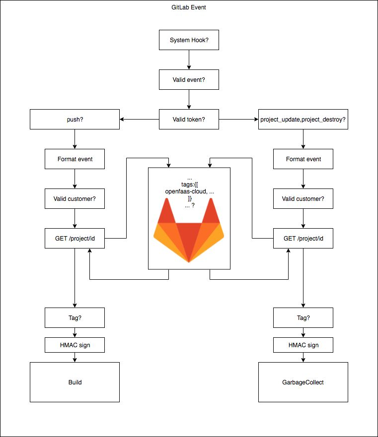

# GitLab

If you would like to set up OpenFaaS Cloud on GitLab follow the steps below.

## Intro

Conceptual Diagram:



GitLab will work with the steps done in [README.md](/README.md) file and some additional requirements:

* GitLab instance

* Configured System Hook

* Additional secrets containing:

  * Secret token which is sent along with System Hook

  * Access token with `api`, `read_repository` and `sudo` rights

* Custom tag or the default `openfaas-cloud` one applied to projects which are intended for the instance

### Configure the base URL to your GitLab instance

In `gitlab.yml` add the base URL of your GitLab instance in field `gitlab_instance` for `system-gitlab-event` function

Example:

```
...
      gitlab_instance: "https://gitlab.example.com/"
...
```

### Configure your System Hook

In your GitLab instance enter the `Admin area` then `System Hooks`.

In the URL field add the URL of your entrypoint to `gitlab-event` function. Example would be:

* `https://system.domain.xyz/gitlab-event` in case you have the edge-router running

* `https://www.domain.xyz/function/system-gitlab-event` in case you have the edge-router turned off

Set up Secret Token along with the URL.

Create `gitlab-webhook-secret` secret that contains the token mentioned above on your OpenFaaS instance the following way:

Kubernetes:

```
kubectl create secret generic -n openfaas-fn gitlab-webhook-secret --from-literal gitlab-webhook-secret="<your_token_here>"
```

Swarm:

```
echo -n "<your_token_here>" | docker secret create gitlab-webhook-secret -
```


The supported events are currently `push` and `project_update`/`project_destroy` through the System Hook so check the `Push events` event only and then `Add system hook`

### Configure your Access Token

This token is mandatory as it gives access to the API from which we take the tag and recognize if you have OpenFaaS Cloud installed, also provides us with a way to clone private/internal repositories and check the groups in which you participate.

In order to create the token you need to have admin access to the GitLab instance, it would be a good idea if you create service account specifically for the purpose of the OpenFaaS Cloud since every status update will come from that account.

Follow the steps below to create the token:

* Navigate to the Settings in your profile

* In the Access Tokens field check the `api` along with `sudo` and `read_repository` field and choose a name

* Press the `Create personal access token` button and copy the content below `Your New Personal Access Token`

* Generate the `gitlab-api-token` secret:

  * Kubernetes:

  ```
  kubectl create secret generic -n openfaas-fn gitlab-api-token --from-literal gitlab-api-token="<your_api_token_here>"
  ```

  * Swarm:

  ```
  echo -n "<your_api_token_here>" | docker secret create gitlab-api-token -
  ```

### Apply installation tag

> Note: the latest editions of GitLab have renamed `tag` to `topic`. Look out for this and don't get caught out.

The *installation tag* (or topic) gives the OpenFaaS Cloud instance information about whether or not we should build the project on the instance.

You can set your own tag by choice in `gitlab.yml` file with environmental variable `installation_tag`. When tag is not set we use the default one which is `openfaas-cloud`.

To apply the tag to your project follow these steps:

* Navigate to the project you want to build on the cloud

* Go to the `Settings` tab and choose `General project`

* In the `Tags` field apply the default `openfaas-cloud` tag or your custom tag and press `Save changes`

* Push a change to the project

You should be able to see your function deployed on your cloud instance.

### Remove the function from the Cloud

Currently there are two ways to remove the function off your OpenFaaS Cloud.

#### Remove the tag:

* Navigate to the project

* Like above navigate to `Settings/General`

* Remove your custom tag or the default `openfaas-cloud` one from `Tags` field

* Save the change

Your function is now deleted.

#### Delete the project

If you delete your project your function will be automatically deleted from the cloud.